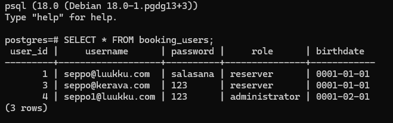
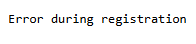
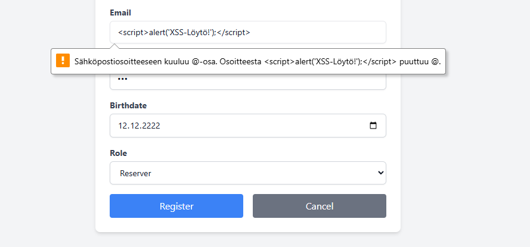

# 🛡️ Penetration Testausraportti: BookingSystem - Phase 1

## 1️⃣ Testin Tiedot

| Tunniste | Arvo |
| :--- | :--- |
| **Tester(s)** | **Name:** Arttu Ronkainen |
| **Purpose** | Tunnistaa tietoturva- ja liiketoimintalogiikan haavoittuvuudet rekisteröinti- ja tunnistautumisprosesseissa. |
| **Scope (Tested components)** | Käyttäjän luonti, roolin määritys ja ikärajan (15v) valvonta. |
| **Exclusions** | Resurssien varauslogiikka (paitsi ikärajatarkistus). |
| **Test approach** | **Gray-box** |
| **Test environment & dates** | **Start:** 02.12.2025 **End:** 03.12.2025 |
| **Test environment details** | Docker (Web-sovellus, PostgreSQL), Google Chrome. |
| **Assumptions & constraints** | Pääsy tietokantaan (`psql`) oli käytettävissä tulosten vahvistamiseen. |

***

## 2️⃣ Executive Summary

| Tunniste | Arvo |
| :--- | :--- |
| **Short summary** | Järjestelmässä havaittiin kaksi kriittistä tietoturvariskiä: salasanat tallennetaan selväkielisenä (Plain Text), mikä aiheuttaa välittömän tietovuotovaaran, ja ikärajan valvonta on helppo ohittaa liiketoimintalogiikan heikkouden vuoksi. Roolien muuttaminen suoraan tietokannassa oli estetty asianmukaisen CHECK constraint -määrityksen ansiosta. |
| **Overall risk level** | **Critical** |
| **Top 5 immediate actions** | 1. **Kiireellinen** korjaus salasanan tallenukseen. |
| | 2. **Kiireellinen** korjaus ikärajan valvontaan. |
| | 3. Varmista, että salasanat on **hashattu & suolattu** |
| | 4. Implementoi vahva roolien ja käyttöoikeuksien tarkistus sovelluslogiikassa. |
| | 5. Korjaa havaitut tekniset viat (esim. ZAP-raportista). |

***

## 3️⃣ Severity scale & definitions

| Severity Level | Description | Recommended Action |
| :--- | :--- | :--- |
| **🔴 High** | A serious vulnerability that can lead to full system compromise or data breach. | **Immediate fix required** |
| **🟠 Medium** | A significant issue that may require specific conditions or user interaction. | Fix ASAP |
| **🟡 Low** | A minor issue or configuration weakness. | Fix soon |
| **🔵 Info** | No direct risk, but useful for system hardening. | Monitor and fix in maintenance |

***

## 4️⃣ Findings

| ID | Severity | Finding | Description | Evidence / Proof |
| :--- | :--- | :--- | :--- | :--- |
| **F-01** | **🟡 Low**  | **Oikeuksien Korotus (Privilege Escalation)** | Tietokantatason CHECK constraint esti luvattoman roolin (Admin) asettamisen SQL-päivityksellä, mikä lisäsi suojausta suoria tietokantahyökkäyksiä vastaan | **Todiste:**  |
| **F-02** | 🔴 **High** | **Ikärajan Valvonnan Ohitus** | Järjestelmä antaa alaikäisen käyttäjän rekisteröityä ja tehdä onnistuneesti resurssivarauksen, rikkoen 15 vuoden ikärajavaatimuksen. | **Todiste:**  |
| **F-03** | 🔴 **High** | **Salasanan Tallennus** | Salasanat tallennetaan tietokantaan **selväkielisenä**.  | **Todiste:**  |
| **F-04** | 🟠 **Medium** | **SQL-Injektio (Tekninen virhe)** | Erikoismerkit rekisteröinnin yhteydessä aiheutti teknisen virheen |  |
| **F-05** | 🔵 **Info** | **XSS-Suodatus (Positiivinen)** | Järjestelmä suodatti onnistuneesti `<` ja `>` -merkit sähköpostikentästä, mikä estää helpot XSS-injektiot. |  |

***

## 5️⃣ OWASP ZAP Test Report (Attachment)

* **Purpose:** Dokumentoida automaattisen passiivisen ja/tai aktiivisen skannauksen tulokset, jotka liittyvät yleisiin teknisiin puutteisiin (esim. puuttuvat tietoturvaotsakkeet).
* **HUOM:** ZAP-raportin on oltava erillinen Markdown-tiedosto vaatimusten mukaisesti.

**Liite:** [Linkki tiedostoon `ZAP_Report.md` BookingSystem-Phase1-kansiossa]

---

